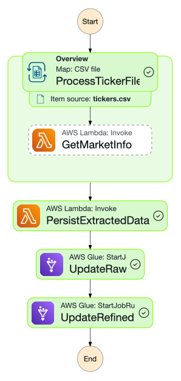

<picture style="display:flex; justify-content:center;">
    
</picture>

# CashFlow - Pipeline de Dados de Ações

Pipeline de dados completo para extração, processamento e análise de ações utilizando **AWS**.
Infraestrutura provisionada com **Terraform** e código de ingestão/ETL em **Python**.

---

## 🚀 Visão Geral

O **CashFlow** é um projeto desenvolvido como parte do **Tech Challenge** da Pós-Tech em Machine Learning Engineering.
Seu objetivo é construir um pipeline batch para transformar dados financeiros brutos em **insights analíticos acessíveis** através de uma arquitetura na AWS.

### 📋 Contexto do Tech Challenge

Este projeto atende aos requisitos do Tech Challenge que exige:
- Pipeline batch para dados de ações.
- Granularidade diária de dados
- Uso obrigatório de AWS S3, Glue, Lambda e Athena
- Transformações específicas (agregações, renomeação, cálculos temporais)
- Particionamento e catalogação automática

---

## ⚙️ Arquitetura

### 🏗️ Decisões Arquiteturais

**Step Functions vs Lambda Simples:**
- **Decisão:** Implementação com **AWS Step Functions** para orquestração
- **Justificativa:**
  - Maior controle de fluxo e tratamento de erros
  - Processamento paralelo de múltiplos tickers
  - Retry automático e monitoramento avançado
  - Escalabilidade para processar centenas de ações simultaneamente

**EventBridge para Agendamento:**
- **Decisão:** Uso do **EventBridge** (anteriormente CloudWatch Events)
- **Justificativa:**
  - Agendamento nativo e confiável
  - Integração direta com Step Functions
  - Facilidade de configuração via Terraform

### 🔄 Fluxo de Dados

1. **Agendamento:** EventBridge executa pipeline diariamente às 10:00 UTC
2. **Orquestração:** Step Functions coordena todo o processo
3. **Extração:** Lambda processa arquivo `tickers.csv` e extrai dados via yfinance
4. **Ingestão:** Dados brutos salvos no S3 (Raw Zone) em formato Parquet
5. **Transformação:** Jobs Glue processam e refinam os dados
6. **Catalogação:** Tabelas criadas automaticamente no Glue Catalog
7. **Consulta:** Dados disponíveis para análise via Athena

<picture style="display:flex; justify-content:center;">
    
</picture>

---

## 🛠️ Tecnologias

- **Python** → extração de dados e transformações ETL
- **Terraform** → infraestrutura como código (IaC)
- **AWS S3** → Data Lake (Raw e Refined Zones)
- **AWS Step Functions** → orquestração de workflow
- **AWS Lambda** → extração de dados e persistência
- **AWS Glue** → ETL e catalogação automática
- **AWS Athena** → consultas SQL analíticas
- **AWS EventBridge** → agendamento de execução
- **yfinance** → API para dados financeiros

---

## 📋 Mapeamento de Requisitos

### ✅ Requisitos Implementados

| Requisito | Implementação | Detalhes Técnicos |
|-----------|---------------|-------------------|
| **R1: Scrap de dados B3** | ✅ Lambda + yfinance | Extração de ações via API yfinance |
| **R2: S3 Parquet particionado** | ✅ Raw Zone | Particionamento por `process_date` |
| **R3: Lambda trigger Glue** | ✅ Step Functions | Orquestração via Step Functions (mais robusto) |
| **R4: Lambda inicia Glue** | ✅ Step Functions | Jobs Glue executados via Step Functions |
| **R5A: Agregações numéricas** | ✅ Glue update_refined | `avg()`, `max()`, `min()` por ticker/data |
| **R5B: Renomeação colunas** | ✅ Glue update_raw | `name→company_name`, `sector→company_sector` |
| **R5C: Cálculos temporais** | ✅ Glue update_refined | Média móvel 7d, lags 1/2/3 meses |
| **R6: Refined particionado** | ✅ Refined Zone | Particionamento por `reference_date` e `ticker` |
| **R7: Catalogação automática** | ✅ Glue Catalog | Tabelas `stocks_raw` e `stocks_refined` |
| **R8: Consulta Athena** | ✅ Athena | Dados disponíveis via SQL |

### 🔧 Decisões Técnicas

**Por que Step Functions ao invés de Lambda simples?**
- **Escalabilidade:** Extrai dados das ações em paralelo
- **Confiabilidade:** Retry automático e tratamento de erros
- **Monitoramento:** Visibilidade completa do pipeline
- **Manutenibilidade:** Fluxo declarativo e versionáve

---

## 📊 Transformações Implementadas

### 🔄 Job Glue: `update_raw`
- **Entrada:** CSV com dados extraídos via `yfinance`
- **Transformações:**
  - Renomeação de colunas (`name` → `company_name`, `sector` → `company_sector`)
  - Formatação de datas para particionamento
  - Adição de coluna `process_date` para controle
- **Saída:** Parquet particionado por `process_date`

### 🔄 Job Glue: `update_refined`
- **Entrada:** Dados da tabela `stocks_raw`
- **Transformações:**
  - **Agregações:** `average_price`, `max_high`, `min_low` por ticker/data
  - **Média móvel:** `price_avg_7d` (7 dias)
  - **Lags temporais:** `price_lag_1_month`, `price_lag_2_month`, `price_lag_3_month`
- **Saída:** Parquet particionado por `reference_date` e `ticker`

---

## 📦 Estrutura do Repositório

```bash
/cashflow
├── tf/                    # Terraform (Infraestrutura)
│   ├── app/              # Recursos da aplicação
│   │   ├── eventbridge.tf    # Agendamento
│   │   ├── step_functions.tf # Orquestração
│   │   ├── glue.tf           # Jobs ETL
│   │   ├── glue_catalog.tf   # Catálogo de dados
│   │   └── lambda.tf         # Funções Lambda
│   └── infra/            # Infraestrutura base (S3, ECR)
├── lambda/               # Funções Lambda
│   ├── get_market_info.py    # Extração de dados
│   └── write_market_info.py  # Persistência S3
├── glue/                 # Scripts ETL
│   ├── update_raw.py         # Processamento inicial
│   └── update_refined.py     # Transformações avançadas
├── sample_data/          # Dados de exemplo
│   └── tickers.csv           # Lista de ações a serem extraidas do yfinance
└── README.md
```

---

## 🔍 Consultando no Athena

### 📈 Exemplo de Consulta Básica
```sql
SELECT
    ticker,
    reference_date,
    average_price,
    price_avg_7d,
    max_high,
    min_low
FROM cashflow.stocks_refined
WHERE ticker = 'PETR4.SA'
AND reference_date BETWEEN '20240101' AND '20240131'
ORDER BY reference_date;
```

### 📊 Análise de Performance
```sql
SELECT
    ticker,
    AVG(average_price) as preco_medio,
    MAX(max_high) as maior_alta,
    MIN(min_low) as menor_baixa,
    AVG(price_avg_7d) as media_movel_7d
FROM cashflow.stocks_refined
WHERE reference_date >= '20240101'
GROUP BY ticker
ORDER BY preco_medio DESC
LIMIT 10;
```

## 🚀 Execução do Pipeline

### ⏰ Agendamento Automático
- **Frequência:** Diária às 10:00 UTC
- **Trigger:** EventBridge → Step Functions
- **Duração estimada:** 5-7 minutos para a lista de ações
