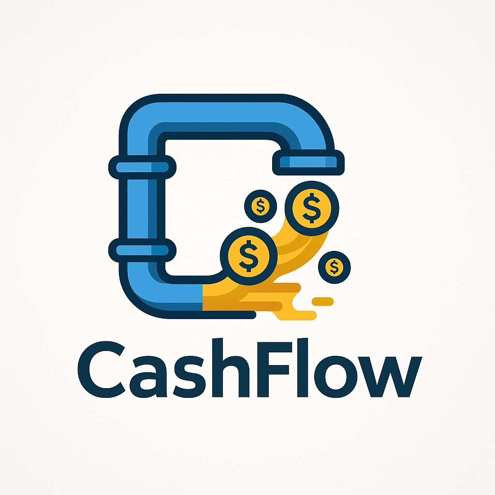

{width=250}

Pipeline de dados da B3 para ingestão, processamento e análise de ações usando **AWS**.  
Infraestrutura provisionada com **Terraform** e código de ingestão/ETL em **Python**.

---

## 🚀 Visão Geral

O **CashFlow** é um projeto desenvolvido como parte do Tech Challenge da Pós-Tech em Machine Learning Engineering.  
Seu objetivo é construir um pipeline batch para transformar dados financeiros brutos em **insights analíticos acessíveis**.

---

## ⚙️ Arquitetura

- **Scraping / Ingestão:** captura de dados da B3 (ações e índices) em granularidade diária.  
- **Data Lake (S3):** armazenamento em formato **Parquet**, particionado por data.  
- **Orquestração (Lambda):** trigger automático que dispara jobs de ETL no Glue.  
- **Transformações (Glue):**
  - Agregações numéricas (soma, média, contagem).  
  - Renomeação de colunas.  
  - Cálculos baseados em datas (média móvel, variações, extremos).  
- **Refined Zone:** dados processados salvos em `/refined` (Parquet, particionado por data e ticker).  
- **Catálogo (Glue Catalog):** tabelas geradas automaticamente.  
- **Consulta (Athena):** dados disponíveis para SQL.


```mermaid
flowchart LR
    A[Scraping - Python] -->|Dados brutos| B[S3 - Raw Zone]
    B -->|Trigger| C[Lambda]
    C -->|Inicia job| D[Glue ETL]
    D -->|Transformações<br>(Agregações, renomeação,<br>cálculos com datas)| E[S3 - Refined Zone]
    E -->|Catalogação automática| F[Glue Catalog]
    F -->|Consulta SQL| G[Athena]
```

---

## 🛠️ Tecnologias

- **Python** → scraping e manipulação de dados  
- **Terraform** → infraestrutura como código (IaC)  
- **AWS S3** → Data Lake  
- **AWS Lambda** → orquestração  
- **AWS Glue** → ETL e catalogação  
- **AWS Athena** → consultas SQL  

---

## 📊 Fluxo Resumido

1. Coleta diária de dados da B3 (ex: `IBOV`).  
2. Armazenamento no S3 em formato Parquet.  
3. Lambda dispara job do Glue.  
4. Transformações e cálculos no Glue.  
5. Dados refinados armazenados e catalogados.  
6. Consulta disponível no Athena.

---

## 📦 Estrutura do Repositório

```bash
/cashflow
├── infra/          # Terraform (S3, Lambda, Glue, Athena)
├── src/            # Scripts Python (scraping, ingestão, transformações)
├── docs/           # Diagramas e documentação
└── README.md
```

---

## 🔍 Consultando no Athena

```sql
SELECT * 
FROM cashflow.refined
WHERE ticker = 'PETR4'
AND dt_ref BETWEEN DATE('2024-01-01') AND DATE('2024-01-31');